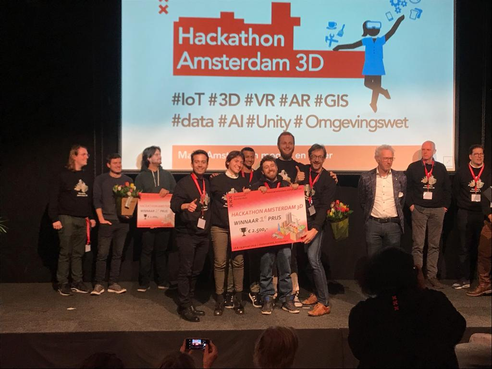

# B9 | First place winning app in the Amsterdam 3D Hackathon 2019



> Includes Vue project, Unity WebGL build and Unity source package.

## Build Setup

``` bash
# install dependencies
npm install

# serve with hot reload at localhost:8080
npm run dev

# build for production with minification
npm run build

# import unity package in unity 2018.3 or higher
```